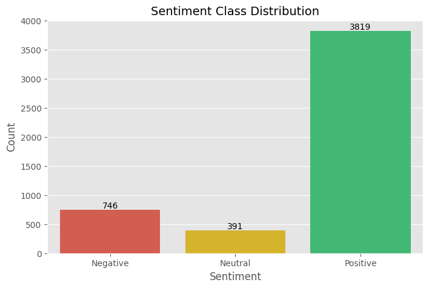
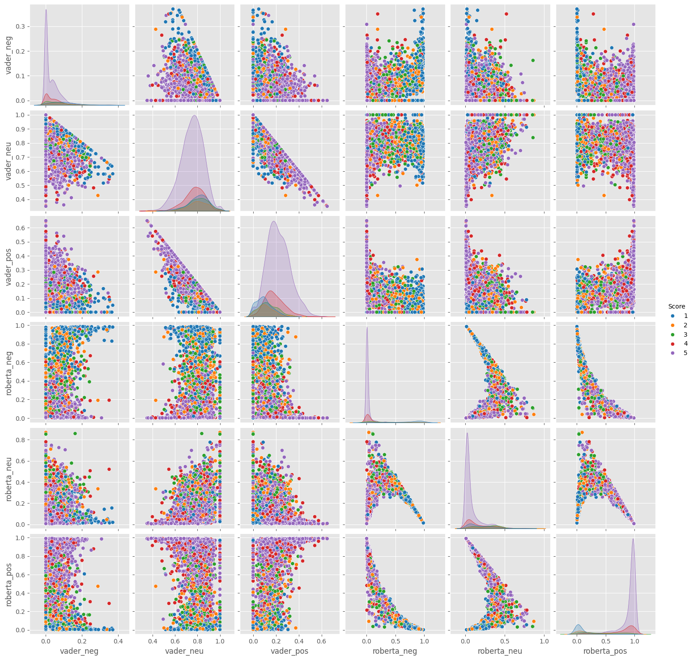
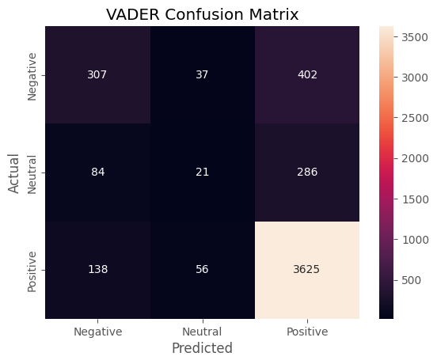
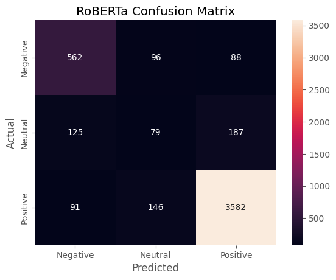

# SENSE 🧠 — **S**entiment **E**xtraction **N**atural Language **S**coring **E**ngine

<div align="center">


<br/>

**SENSE — a dual-model NLP pipeline that extracts, scores, and explains sentiment in any piece of text, packaged as an interactive Streamlit dashboard.**

</div>

---

## 📌 Project Overview

Understanding *what people feel* about a product, service, or experience is one of the most valuable signals a business can have — but reading thousands of reviews manually doesn't scale.

SENSE answers the question:

> **"Given any piece of text, what sentiment does it express — and why?"**

It combines a fast, interpretable rule-based model (**VADER**) with a context-aware transformer (**RoBERTa**) into a single reusable scoring engine, then wraps it in a full-featured dashboard for both single-text and batch analysis.

> 💡 **Note on the dataset:** SENSE's NLP engine was developed and benchmarked on a 5,000-review sample drawn from the Amazon Fine Food Reviews dataset (~568,000 reviews total) as a real-world testbed. While the validation set is food-focused, the underlying RoBERTa-based model generalizes to any text domain — product reviews, app feedback, social media comments, support tickets, and more.

---

## 📚 Table of Contents

<ul>
  <li><a href="#-project-overview">📌 Project Overview</a></li>
  <li><a href="#-live-demo">🚀 Live Demo</a></li>
  <li><a href="#-project-structure">📂 Project Structure</a></li>
  <li><a href="#️-tech-stack">🛠️ Tech Stack</a></li>
  <li><a href="#-validation-dataset">📊 Validation Dataset</a></li>
  <li><a href="#-model-training--performance">🤖 Model Training & Performance</a></li>
  <li><a href="#-model-validation-visuals">📈 Model Validation Visuals</a></li>
  <li><a href="#-sense-engine">🔮 The SENSE Engine</a></li>
  <li><a href="#-application-features">🚀 Application Features</a></li>
  <li><a href="#-use-cases">🎯 Use Cases</a></li>
  <li><a href="#️-run-locally">▶️ Run Locally</a></li>
  <li><a href="#-future-scope">🔭 Future Scope</a></li>
  <li><a href="#-author">👩‍💻 Author</a></li>
</ul>

---

## 🚀 Live Demo

<div align="center">

[](#)
[](notebooks/sense.ipynb)


> ⚠️ **App may be sleeping** — Hugging Face free tiers may hibernate. Click a **Live App** link and wait ~30s for it to spin up.

</div>

---

## 📂 Project Structure

```
SENSE/
│
├── assets/
│   ├── visuals/                      # Model validation visuals (from notebook)
│   └── logo.png                      # App logo
│
├── models/
│   └── roberta_model.py              # RoBERTa model loading utilities
│
├── notebooks/
│   └── sense.ipynb                   # Full EDA + model training/comparison notebook
│
├── src/
│   ├── sentiment.py                  # Core SENSE() scoring function
│   ├── batch_analyzer.py             # SENSE_BATCH() for multi-review scoring
│   ├── explainer.py                  # SHAP-based word-level explainability
│   ├── preprocessing.py              # Text cleaning utilities
│   └── visualization.py              # Chart helper functions
│
├── word_highlight.py                 # Renders SHAP word-highlight UI
├── app.py                            # Streamlit application
├── requirements.txt
├── .gitignore
└── README.md
```

---

## 🛠️ Tech Stack

<div align="center">

| 🏷️ Category | 🔧 Tools |
|---|---|
| 🐍 **Language** | Python 3.11 |
| 🤖 **Models** | VADER (NLTK), RoBERTa (`cardiffnlp/twitter-roberta-base-sentiment`) |
| 🧠 **NLP / ML** | Hugging Face Transformers, SHAP, Scikit-learn, SciPy |
| 📊 **Data** | Pandas, NumPy |
| 📈 **Visualization** | Plotly, Matplotlib, Seaborn |
| 🚀 **Deployment** | Streamlit Cloud, Hugging Face Spaces |
| 📄 **Reporting** | fpdf2 (PDF export) |

</div>

---

## 📊 Validation Dataset

The model was benchmarked using the **Amazon Fine Food Reviews dataset from Kaggle**.

- **Total Records:** ~568,000 reviews (full dataset)
- **Sample Used:** 5,000 reviews — large enough to observe meaningful patterns, small enough to iterate fast
- **Key Columns:** `Id`, `Score` (1–5 star rating, used as ground truth), `Text` (raw review), `Summary` (review title)

**Sentiment label mapping:**

| Star Rating | Label |
|---|---|
| 1–2 ⭐ | Negative |
| 3 ⭐ | Neutral |
| 4–5 ⭐ | Positive |

**Resulting class distribution (5,000-review sample):**

| Sentiment | Count | % |
|---|---|---|
| 😊 Positive | 3,846 | 77.6% |
| 😠 Negative | 759 | 15.3% |
| 😐 Neutral | 395 | 8.0% |

---

## 🤖 Model Training & Performance

Two models were trained and benchmarked against the star-rating ground truth:

<div align="center">

| Metric | VADER (Rule-Based) | RoBERTa (Transformer) |
|---|---|---|
| ⚡ Overall Accuracy | 0.80 | **0.85** |
| 😊 Positive F1 | 0.89 | **0.93** |
| 😠 Negative F1 | 0.48 | **0.74** |
| 😐 Neutral F1 | 0.08 | **0.22** |
| 📊 Macro Avg F1 | 0.49 | **0.63** |

</div>

**Why RoBERTa wins:** VADER is a fast, lexicon-based scorer with no training required — great as a baseline, but it struggles with negation, sarcasm, and ambiguous/neutral language. RoBERTa, fine-tuned on ~58M tweets for 3-class sentiment, understands full-sentence context — giving it a decisive edge on the hardest classes (**Negative** and **Neutral**), which is exactly where business value lies in catching dissatisfied customers.

> ⚠️ Reviews exceeding RoBERTa's 512-token limit (44 reviews, 0.88% of the sample) were caught and skipped via a `try/except RuntimeError` guard during inference.

---

## 📈 Model Validation Visuals

<table>
  <tr>
    <td align="center" width="50%">
      
      <br/>
      <em>Fig 1 — Ground-truth sentiment class distribution (3,846 Positive / 759 Negative / 395 Neutral)</em>
    </td>
    <td align="center" width="50%">
      
      <br/>
      <em>Fig 2 — Pairwise comparison of VADER vs RoBERTa sentiment scores, coloured by star rating</em>
    </td>
  </tr>
  <tr>
    <td align="center" width="50%">
      
      <br/>
      <em>Fig 3 — VADER confusion matrix: strong on Positive, weak on Neutral</em>
    </td>
    <td align="center" width="50%">
      
      <br/>
      <em>Fig 4 — RoBERTa confusion matrix: more diagonal-dominant, especially on Negative</em>
    </td>
  </tr>
</table>

---

## 🔮 The SENSE Engine

The validated RoBERTa pipeline was packaged into two reusable functions:

```python
SENSE(text)
# → {
#     "Sentiment": "Positive",
#     "Confidence (%)": 99.05,
#     "Sentiment Score": 0.989,
#     "Probabilities": {"Positive": 99.05, "Neutral": 0.78, "Negative": 0.17}
#   }

SENSE_BATCH(texts)
# → returns a DataFrame with Sentiment + Confidence for every input text
```

**Pipeline:** Tokenize → Forward Pass → Softmax → Score Dictionary, with raw logits normalised via `scipy.special.softmax` into interpretable probabilities summing to 1.0.

---

## 🚀 Application Features

The deployed Streamlit dashboard includes:

- 🔍 **Single Review Analysis** — paste any text and get instant sentiment, confidence %, and a sentiment score
- 📊 **Sentiment Strength & Confidence Meters** — visual progress bars for at-a-glance interpretation
- 📈 **Probability Distribution Chart** — Plotly bar chart breaking down Positive / Neutral / Negative probabilities
- 🔬 **Word-Level SHAP Highlighting** — colour-coded tokens showing exactly which words drove the model's prediction, with hoverable contribution scores
- 📂 **Batch CSV Analysis** — upload any CSV, pick the text column, and score every row at once
- 📊 **Aggregate Batch Stats** — % Positive/Neutral/Negative, average confidence, and a sentiment distribution donut chart
- 🗂️ **Filterable Results Table** with colour-coded sentiment labels and CSV export
- 📄 **PDF Report Export** — download a clean, branded PDF summary of any single-review analysis
- 🎨 **Custom Dark Theme** — polished, cohesive dark UI built with custom CSS

---

## 🎯 Use Cases

SENSE works on **any text**, not just product reviews:

- 🛒 Product & e-commerce reviews
- 📱 App store feedback
- 💬 Social media comments
- 🎫 Customer support tickets
- 📋 Survey responses

---

## ▶️ Run Locally

```bash
# 1. Clone the repository
git clone https://github.com/mysticalayushi/SENSE.git
cd SENSE

# 2. Install dependencies
pip install -r requirements.txt

# 3. Launch the Streamlit app
streamlit run app.py
```

Or explore the full analysis notebook:
```bash
jupyter notebook notebooks/sense.ipynb
```

---

## 🔭 Future Scope

- [ ] 🔧 **Fine-tune RoBERTa** on domain-specific vocabulary to close the gap on Neutral and Negative classes
- [ ] 📡 **Real-time sentiment monitoring dashboards** for streaming review feeds
- [ ] 🌍 **Multilingual support** via `xlm-roberta` for non-English text
- [ ] 🔬 **Aspect-Based Sentiment Analysis (ABSA)** — identify *which aspect* (price, delivery, quality, etc.) each sentiment applies to
- [ ] 📄 **Batch PDF reports** alongside the existing single-review export

---

## 📋 Project Information

<div align="center">

| 📌 Field | 📝 Detail |
|---|---|
| 👩‍💻 **Created by** | Ayushi Rai |
| 🧠 **Models Used** | VADER (NLTK) / RoBERTa (Hugging Face Transformers) |
| 🎯 **Task** | 3-Class Sentiment Classification (Positive / Neutral / Negative) |
| 📊 **Validation Dataset** | Amazon Fine Food Reviews — 5,000-review sample (568K total) |
| 📈 **Best Accuracy** | 85% (RoBERTa) |
| 📅 **Date** | June 2026 |

</div>

---

## 👩‍💻 Author

<div align="center">

**Ayushi Rai**
[](https://github.com/mysticalayushi)

</div>

---

<div align="center">
<sub>If you found this project helpful, consider giving it a ⭐ on GitHub!</sub>
</div>

---

<div align="center">
  <a href="#sense-">⬆️ Back to Top</a>
</div>